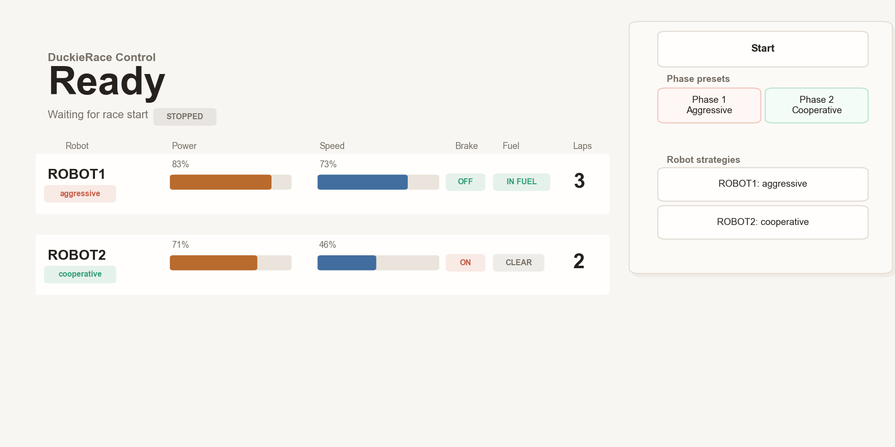

# DuckieRace

DuckieRace is a ROS/catkin demonstration system for multi-robot racing with
Duckietown DB19 robots. It combines onboard lane following, overhead-camera
race supervision, fuel-zone handling, lap counting, and a live race-control GUI.

The project is intended for lab demos, student experiments, and public
presentations about autonomous driving, shared infrastructure, congestion, and
cooperative robot behavior.



## What It Does

- Runs multiple Duckietown robots on a printed race track.
- Uses two overhead USB cameras to detect AprilTags and track robot positions.
- Defines fuel zones, merge zones, charge gates, ignore zones, and finish lines
  from camera-specific YAML configuration.
- Publishes per-robot race state such as fuel-zone presence and lap counts.
- Runs robot-side lane following, local braking, charging, and alternative-line
  behavior.
- Provides a PC-side race GUI for start/stop control, phase presets, robot
  strategy selection, power level, speed, brake state, fuel-zone state, and laps.
- Includes a PC-side virtual driver for scripted behavior modes:
  `manual`, `conservative`, `aggressive`, `cooperative`, and `adaptive`.

## Repository Layout

This repository is organized as local snapshots of the two deployment sides:

```text
.
|-- PC_catkin_src/
|   |-- vpa_duckierace/        # Main PC race control, cameras, zones, GUI
|   |-- vpa_robot_operation/   # PC-side copy of operation code
|   |-- vpa_robot_interface/   # PC-side copy of robot interface code
|   |-- vpa_trafficsignal/     # Traffic-signal experiments/tools
|   `-- vpa_miniccam_tool/     # MiniCCAM helper tools
|-- PI_catkin_src/
|   |-- vpa_robot_interface/   # Robot hardware interface nodes
|   |-- vpa_robot_operation/   # Robot lane-following and DuckieRace logic
|   |-- vpa_robot_perception/  # Robot perception nodes
|   `-- vpa_duckierace/        # Robot-side DuckieRace package snapshot
|-- demo.md                    # Detailed operation manual
`-- race_gui_preview_new.png   # Current GUI preview
```

`PC_catkin_src/` and `PI_catkin_src/` are not meant to be merged into one
catkin workspace blindly. They represent the main-PC and robot-side deployment
contexts respectively. Identical package names on both sides are expected.

## System Architecture

DuckieRace is split across a main PC and one or more robots.

### Main PC

The main PC runs the global race-control components:

- USB camera drivers for the two overhead cameras.
- AprilTag-based zone and lap detection.
- Zone-state aggregation across the two cameras.
- Race GUI.
- Optional virtual driver nodes for PC-side strategy control.

Important package:

- `PC_catkin_src/vpa_duckierace`

Common launch files:

```bash
roslaunch vpa_duckierace racecontrol_camera.launch
roslaunch vpa_duckierace zone_manager.launch
roslaunch vpa_duckierace start_racecontrol.launch
roslaunch vpa_duckierace virtual_driver.launch
```

Common GUI command:

```bash
rosrun vpa_duckierace race_gui.py
```

### Robot / Raspberry Pi

Each robot runs its local hardware and driving stack:

- Camera, motor, ToF, and low-level interface nodes.
- Lane following on the red/yellow track.
- Local brake handling.
- Fuel-zone charging behavior.
- Robot namespace-specific ROS topics.

Important packages:

- `PI_catkin_src/vpa_robot_interface`
- `PI_catkin_src/vpa_robot_operation`
- `PI_catkin_src/vpa_robot_perception`

Common robot-side launch file:

```bash
roslaunch vpa_robot_operation duckierace_start.launch
```

## Requirements

The exact deployment depends on the lab setup, but the system expects:

- ROS with catkin.
- Python ROS nodes using `rospy`.
- Duckietown DB19-compatible robots.
- Two overhead USB cameras visible to the main PC.
- AprilTags on the track and on top of each robot.
- A shared network between the main PC and all robots.
- ROS packages such as `usb_cam`, `image_transport`, `sensor_msgs`,
  `std_msgs`, `cv_bridge`, `dynamic_reconfigure`, and the robot interface
  packages.

The package manifests under `PC_catkin_src/*/package.xml` and
`PI_catkin_src/*/package.xml` are the source of truth for catkin dependencies.

## Basic Setup

### Main PC Workspace

Copy the PC-side packages into the main PC catkin workspace:

```bash
mkdir -p ~/catkin_ws/src
cp -r PC_catkin_src/* ~/catkin_ws/src/
cd ~/catkin_ws
catkin_make
source devel/setup.bash
```

### Robot Workspace

Copy the robot-side packages into each robot's catkin workspace:

```bash
mkdir -p ~/catkin_ws/src
cp -r PI_catkin_src/* ~/catkin_ws/src/
cd ~/catkin_ws
catkin_make
source devel/setup.bash
```

Configure ROS networking so that the main PC and robots share the same ROS
master and can resolve each other's advertised IP addresses.

## Configuration

The main PC race package uses YAML configuration files under:

```text
PC_catkin_src/vpa_duckierace/config/
```

Important files include:

- `robot_display_config.yaml` - controls which robots are shown in the GUI and
  their display names.
- `tag_robot_map.yaml` - maps ROS robot names to AprilTag IDs.
- `zones_cam1.yaml` and `zones_cam2.yaml` - camera-specific zone definitions.

Every participating robot must have a unique AprilTag ID and a matching ROS
namespace.

## Camera and Zone Calibration

Zone calibration is required whenever cameras, track position, or lighting
change significantly.

Typical workflow:

1. Start camera nodes on the main PC:

   ```bash
   roslaunch vpa_duckierace racecontrol_camera.launch
   ```

2. Capture one clean calibration image per overhead camera. Only the three
   calibration tags for that camera should be visible, and no robots should be
   in the image.

3. Save the images as:

   ```text
   vpa_duckierace/test/image1.png
   vpa_duckierace/test/image2.png
   ```

4. Run automatic zone calibration:

   ```bash
   cd ~/catkin_ws/src/vpa_duckierace
   python scripts/auto_zone_cali.py
   ```

This generates or updates `zones_cam1.yaml` and `zones_cam2.yaml`.

## Running a Race

1. Start race control and camera-side zone management on the main PC:

   ```bash
   roslaunch vpa_duckierace start_racecontrol.launch
   ```

2. Start each robot's DuckieRace stack:

   ```bash
   roslaunch vpa_robot_operation duckierace_start.launch
   ```

3. Optionally start the PC-side virtual driver:

   ```bash
   roslaunch vpa_duckierace virtual_driver.launch
   ```

4. Start the race GUI:

   ```bash
   rosrun vpa_duckierace race_gui.py
   ```

5. Press `Start` in the GUI. The GUI performs a countdown and then releases the
   global brake topic. Robots still obey their local brake and local control
   logic.

For a full step-by-step operating procedure, see [demo.md](demo.md).

## Race GUI

The GUI is implemented in:

```text
PC_catkin_src/vpa_duckierace/scripts/race_gui.py
```

It shows:

- Robot display name.
- Driving mode.
- Power level.
- Speed percentage.
- Brake state.
- Fuel-zone state.
- Lap count.

The lap count is computed as:

```text
/<robot>/usb_cam_1/lap_count + /<robot>/usb_cam_2/lap_count
```

The GUI also provides:

- Start/stop race control.
- Phase presets for aggressive and cooperative behavior.
- Per-robot strategy cycling.

## Virtual Driver

The PC-side virtual driver is implemented in:

```text
PC_catkin_src/vpa_duckierace/scripts/virtual_driver_node.py
```

It publishes joystick-like commands to robot namespaces and supports multiple
behavior modes:

- `manual`
- `conservative`
- `aggressive`
- `cooperative`
- `adaptive`

The virtual driver includes a charging state machine that can stop in the fuel
zone, charge, and release the brake once charging is complete.

## Key ROS Topics

Representative topics include:

```text
/global_brake
/<robot>/power_level
/<robot>/speed_percent
/<robot>/local_brake
/<robot>/in_fuel_zone
/<robot>/in_charge_gate_zone
/<robot>/driving_mode
/<robot>/set_driving_mode
/<robot>/usb_cam_1/lap_count
/<robot>/usb_cam_2/lap_count
```

Camera-specific zone managers may also publish intermediate per-camera zone
states before they are aggregated into final robot-level topics.

## Demo Concept

DuckieRace can be used to compare uncoordinated and cooperative behavior:

1. In an aggressive or free-play phase, robots tend to block each other, compete
   for charging access, and create congestion.
2. In a cooperative phase, robots can yield, coordinate charging, and use
   alternative routes more deliberately.

The visible success metric is total lap count across all robots.

## Documentation

- [demo.md](demo.md) - detailed operating manual.
- Package-level README files under `PC_catkin_src/` and `PI_catkin_src/`.
- ROS launch files under each package's `launch/` directory.

## License

The ROS package manifests in this repository declare the project packages under
the MIT license.
